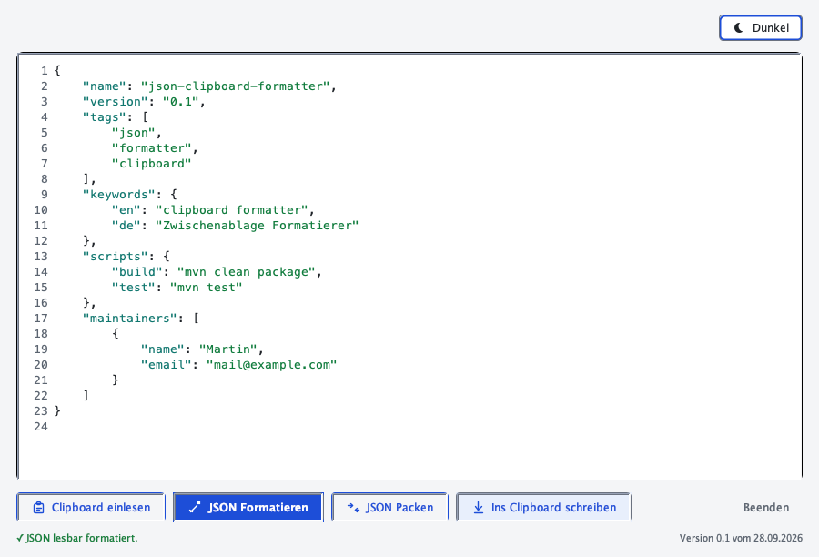
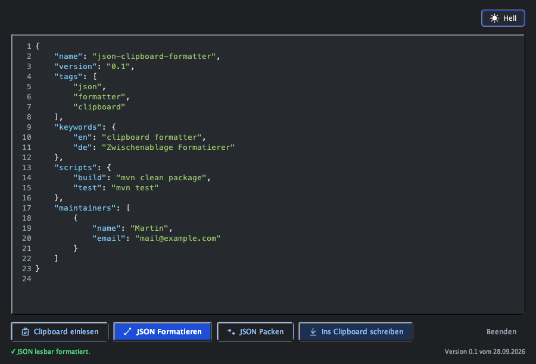

# JSON Clipboard Formatter

Liest JSON aus der Zwischenablage, macht es lesbar oder packt es auf eine
Zeile und schreibt es zurück. Für macOS und Windows, ohne Installation, ohne
Netzwerkzugriff, ohne Konto.



## Was es tut

| Taste | Knopf | Wirkung |
| --- | --- | --- |
| `L` | Clipboard einlesen | Übernimmt den Text aus der Zwischenablage ins Textfeld |
| `F` | JSON Formatieren | Ein Element je Zeile, vier Leerzeichen Einrückung |
| `M` | JSON Packen | Alles auf eine Zeile, kein Leerraum zwischen den Werten |
| `C` | Ins Clipboard schreiben | Schreibt den Inhalt des Textfelds zurück |
| `B` | Beenden | Schliesst das Fenster |

Rechts oben wechselt das Programm zwischen hellem und dunklem Design. Das ist
die einzige Einstellung, und sie wird nicht gespeichert: Beim Start ist das
Fenster immer hell.

Der übliche Ablauf ist `L`, dann `F`, dann `C`. Wer eine Datei klein bekommen
will, nimmt `L`, `M`, `C`. Der Inhalt des Textfelds geht dabei immerhin beide
Wege — es wird nichts überschrieben, was nicht vorher sichtbar im Fenster stand.

## Was es einliest und was zurückgibt

Eingelesen wird JSONC, also JSON mit den Erweiterungen, die in der Praxis
vorkommen:

```jsonc
// Kommentar am Anfang
{
  /* Kommentar in der Mitte */
  "name": "beispiel",   // Kommentar am Zeilenende
  "werte": [1, 2, 3,],
}
```

Zurück kommt striktes JSON: Kommentare und das Nachlaufkomma sind weg, ein
Byte-Order-Mark am Anfang wird entfernt, und die Datei endet mit genau einem
Zeilenumbruch. `tsconfig.json`, `.eslintrc.json` und die Konfigurationsdateien
vieler Werkzeuge lassen sich so unverändert an Stellen weiterverwenden, die nur
JSON lesen.

Werte werden nicht verändert. Zahlen bleiben in der Schreibweise, in der sie
dastehen (`1.50` wird nicht zu `1.5`, `1e3` nicht zu `1000`), Zeichenketten
behalten ihre Fluchtfolgen (`\u00e4` wird nicht zu `ä`), die Reihenfolge der
Schlüssel bleibt, und doppelte Schlüssel bleiben doppelt. Ein Kommentar
innerhalb einer Zeichenkette ist Text: In `"http://beispiel"` ist `//` kein
Kommentar.

Zwei nachgestellte Klammern sind ein Fehler, ein einzelnes Komma auch:

```jsonc
{
  "a": 1,
  "b": 2,,
}
```

```
❌ Zeile 3, Spalte 10: Zwei Kommas nacheinander sind zu viel. Der Text ist unverändert geblieben.
```

Kommt kein JSON heraus, bleibt der Text stehen, in dem er war, und die Meldung
nennt Zeile und Spalte des Problems. Es wird nichts repariert und nichts
geraten.

## Die Schranke in der Statuszeile

Formatieren, Packen und Schreiben sind gesperrt, solange der Text nicht als
JSON erkannt wird. Erkannt wird am ersten sinntragenden Zeichen nach Leerraum
und Kommentaren:

| Text | Erkannt? | Warum |
| --- | --- | --- |
| `{ "a": 1 }` | ja | `{` |
| `  // Kommentar` dann `{` | ja | Kommentare und Leerraum werden übersprungen |
| `-3.5` | ja | `-` und Ziffer |
| `"text"` | ja | `"` |
| `true` | ja | eines der drei Wörter als Ganzes |
| `42` | ja | Ziffer |
| `nein` | nein | kein JSON-Startzeichen |
| `nullx` | nein | `null` muss ein ganzes Wort sein |
| `Einkaufsliste` | nein | Fliesstext |

Diese Prüfung ist eine Vermutung, keine Analyse, und soll auch eine sein: Sie
läuft nach jedem Tastendruck und darf den Text nicht sperren, an dem gerade
getippt wird. Der Formatter bleibt der Richter. Die Wörter `true`, `false` und
`null` werden nur als ganze Wörter akzeptiert, damit `nein` nicht als Wert
durchgeht.

## Formatiertes Ergebnis

Eingabe:

```jsonc
{"name":"beispiel","liste":[1,2],"leer":{},"n":null}
```

Nach `JSON Formatieren`:

```json
{
  "name": "beispiel",
  "liste": [
    1,
    2
  ],
  "leer": {},
  "n": null
}
```

Nach `JSON Packen`:

```json
{"name":"beispiel","liste":[1,2],"leer":{},"n":null}
```

Regeln in der kurzen Form:

- Vier Leerzeichen je Ebene.
- Ein Element je Zeile, auch einzelne Zahlen in einer Liste.
- Leere Objekte und leere Listen bleiben einzeilig: `{}` und `[]`.
- Genau ein abschliessender Zeilenumbruch, immer Unix, auch wenn die Eingabe
  Windows-Zeilenenden hatte.
- Skalarwerte an der Wurzel sind gültig: `42`, `"text"` und `true` werden
  genauso angenommen wie ein Objekt.

## Warum kein Formatter von fremd

Ein JSON-Formatters von fremd hätte zwei Nachteile, und beide wiegen schwer.
Er ist JavaScript, also braucht er eine Laufzeit, die auf einem nackten System
nicht da ist — und eine Java-Anwendung, die eine mitbringt, ist keine schlanke
Anwendung mehr. Und er rückt Formate um, von denen man annimmt, sie seien
unverändert: `1.50` zu `1.5`, doppelte Schlüssel zu einem, Tags in Grossbuchstaben
zu Kleinschreibung.

Beides steht hier nicht. Der Formatter arbeitet auf dem eigenen Lexer, und
jede Ausgabe wird noch einmal gelesen und Token für Token mit der Eingabe
verglichen, bevor sie in die Zwischenablage geht. Stimmt die Zahl der Stücke
nicht oder weicht eines ab, bricht der Vorgang ab, statt etwas zu liefern.

## Grenzen

- **Tief verschachtelte Eingaben kosten quadratisch viel Speicher.** Jede Ebene
  rückt ein, das wächst mit dem Quadrat der Tiefe. Gemessen, jeweils ein Objekt
  in Objekten, Ausgabe in Zeichen:

  | Tiefe | Ausgabe |
  | --- | --- |
  | 1 000 Ebenen | 4 MB |
  | 2 000 Ebenen | 16 MB |
  | 4 000 Ebenen | 64 MB |
  | 20 000 Ebenen | rund 1,6 GB |
  | 100 000 Ebenen | rund 40 GB, bricht ab |

  Prüfen und Packen sind linear; nur die Ausgabe ist es nicht. Es gibt bewusst
  keine Tiefenbegrenzung, damit nicht zwei Klassen von Dateien entstehen:
  lesbar und schreibbar.
- **Ab 100 000 Zeichen wird nicht mehr eingefärbt.** Der Text bleibt vollständig
  bearbeitbar, nur die Hervorhebung endet dort. Der Formatter liest weiterhin
  alles.
- **Kein Sitzungszustand.** Theme, Fensterposition und Verlauf werden nicht
  gespeichert.

## Loslegen

**macOS**

```bash
git clone https://github.com/martindobranski/jsonClipboardFormatter.git
cd jsonClipboardFormatter
./start.sh
```

`start.sh` baut das Programm beim ersten Start selbst. Weitere Schalter:
`./start.sh -Neu` baut neu, `./start.sh -Pruefen` prüft nur die Umgebung und
baut nichts, `./start.sh -Xmx512m` reicht ein JVM-Argument durch. Fehlt Java,
sucht das Skript zuerst in `./jre`, dann in `start.local.conf`, dann in der
Umgebungsvariable `JSONFORMATTER_JAVA`, dann in `JAVA_HOME`, dann im Pfad.
Details in [docs/anleitung-macos.md](docs/anleitung-macos.md).

**Windows**

Aus dem Release das ZIP holen, entpacken, `start.bat` doppelklickbar machen.
Das ZIP enthält die Laufzeit, das Programm und `start.conf.example`; Maven wird
nicht gebraucht. Wer selbst baut, braucht Java 17 oder neuer. Details in
[docs/anleitung-windows.md](docs/anleitung-windows.md).

Zum Nachbauen aus dem Quelltext:

```bash
mvn clean verify
```

Das Ergebnis liegt in `target/JsonClipboardFormatter-0.1.jar` und startet mit
`java -jar target/JsonClipboardFormatter-0.1.jar`. `mvn -o` funktioniert
offline, wenn die Abhängigkeiten einmal da sind.



## Wie das Programm arbeitet

```
Zwischenablage
      |
      v
  JsonLexer    zerlegt den Text in Token, meldet Fehler mit Zeile und Spalte
      |
      v
  JsonLeser    prüft die Struktur und verwirft Nachlaufkommas
      |
      v
  JsonFormat   baut daraus Text: schoen() oder dicht()
      |
      v
  Clipboard    legt das Ergebnis in die Zwischenablage
```

`JsonLeser` arbeitet mit einem Stapel statt mit Rekursion, eine 100 000 Ebenen
tiefe Datei lässt sich also prüfen, ohne dass der Aufrufstapel überläuft.
`JsonFormat.schoen` ist der einzige Teil, der nicht linear arbeitet; siehe
Grenzen oben.

## Quellen und Tests

```
src/main/java/signaliduna/
  JsonClipboardFormatter.java   Fenster und Programmstart
  FormatterPanel.java           Oberfläche, Tasten, Aktionen
  JsonDetector.java             die Schranke: sieht der Text nach JSON aus?
  JsonSyntaxHighlighter.java    Syntaxfärbung ohne Regex
  JsonLexer.java                JSONC in Token, mit Ort für jeden Fehler
  JsonLeser.java                Strukturcheck ohne Rekursion
  JsonToken.java                ein Stück Text mit Position
  JsonFehler.java               Fehler mit Zeile und Spalte
  JsonFormat.java               Ausgabe: schoen() und dicht()
  ClipboardService.java         Zugriff auf die Zwischenablage
  Theme.java                    hell und dunkel
src/main/resources/
  version.properties            Version und Datum, von Maven gefüllt
```

184 Tests, davon 1 absichtlich übersprungen: `fokusring_wird_gemalt` prüft, ob
der Fokusring wirklich gezeichnet wird, und braucht dafür ein Fenster im
Vordergrund. Im Hintergrundlauf — in der CI, unter Linux, beim Ausführen aus
einem Test heraus — bekommt der Knopf den Fokus nicht, und der Test wird
übersprungen statt geraten. Auf macOS und auf der Windows-CI ist es jeweils
genau dieser eine Fall.

| Klasse | Tests | Wofür |
| --- | --- | --- |
| `JsonFormatTest` | 24 | Formatieren, Packen, unveränderte Werte, Tokenstrom |
| `JsonLexerTest` | 33 | Zahlen, Fluchtfolgen, Kommentare, BOM, Fehlerorte |
| `FormatterPanelTest` | 96 | alle vier Aktionen, Fehlerpfade, Theme, Tasten, Zähler |
| `StartSkriptTest` | 28 | beide Startskripte, beide Prüfmodi, Konfigurationsdatei |
| `ClipboardServiceTest` | 3 | Lesen und Schreiben der Zwischenablage |

Ein Hinweis für alle, die `@Nested` verwenden: Surefire schreibt für die
verschachtelten Klassen in `target/surefire-reports/*.txt` `Tests run: 0`, die
Gesamtsumme auf der Konsole zählt sie aber mit — hier stehen 184 in der
Gesamtsumme und 31 in der Summe der Berichte. Wer die Zahl aus den Berichten
abliest, hält eine grüne, aber leere Klasse für eine volle. Die Zahlen in der
Tabelle oben sind deshalb je Klasse einmal einzeln gezählt, nicht aus den
Berichten abgelesen.

## Aufbau

Java 17, Swing mit FlatLaf 3.2.5 für das Design, JUnit 5.10.2 für die Tests.
Zur Laufzeit hängt das Programm an nichts außer Java. Die Abhängigkeiten
werden in ein einziges Jar gepackt, damit der Start auf einem fremden Rechner
nicht daran hängt, was dort installiert ist.

`start.bat` hat Windows-Zeilenenden und nur ASCII, weil eine Batch-Datei mit
Unix-Zeilenenden sich weigert zu laufen. Die Workflows in `.github/workflows/`
halten sich aus demselben Grund an ASCII. `start.local.conf` wird nicht
versioniert: Sie ist für die eigenen Pfade da, und das Skript weist auf die
Vorlage `start.conf.example` hin, falls sie fehlt.

Zwei Workflows laufen bei jedem Push auf `main`:

- `windows-pruefung.yml` baut das Programm, führt alle 184 Tests aus und
  startet `start.bat` auf einem echten `windows-latest`.
- `release-windows.yml` baut zusätzlich das ZIP mit der Java-Laufzeit und
  startet es in einem Lauf, in dem `JAVA_HOME` und `PATH` kein Java finden.
  Damit ist belegt, dass das ZIP auf einem Rechner ohne Java startet — nicht
  nur, dass es sich bauen lässt.

## Auf macOS per Tastenkürzel

Raycast kann das Programm starten, ohne dass ein Fenster offen ist. Der
mitgelieferte Aufruf liegt in `raycast/start-json-formatter.sh`. Unter
*Extensions* den Skriptordner hinzufügen, dann erscheint der Befehl
`JSON Formatter` in Raycast. Die Anleitung steht in
[docs/anleitung-macos.md](docs/anleitung-macos.md).

## Grenzen der Sichtbarkeit

Der Formatter erkennt JSON an der Form, nicht am Inhalt. `{"bestellung": 42}`
und `{"betrag": 42}` sehen gleich aus, und das ist gewollt: Das Programm soll
nicht raten, was in einer Datei steht.

Er fasst auch nur Text an. Kopiert jemand ein Bild in die Zwischenablage und
drückt `L`, bleibt das Textfeld leer und die Statuszeile sagt es. Es wird kein
Bild in Text verwandelt und kein Text in ein Bild.

## Wenn etwas nicht passt

| Beobachtung | Ursache |
| --- | --- |
| Formatieren, Packen und Schreiben sind grau | Der Text sieht nicht nach JSON aus. Die Statuszeile sagt, welcher erste Eindruck fehlt |
| `❌ Zeile X, Spalte Y: ...` | Der Text enthält einen Fehler. Die Stelle ist markiert, der Text ist unverändert |
| `error: could not find or load main class` | Jar fehlt. `mvn clean package` baut neu |
| `start.sh: Permission denied` | `chmod +x start.sh` |
| Fenster öffnet, ist aber nicht zu sehen | Der Icon am Dock oder im Taskleistenbereich anklicken |
| `OutOfMemoryError` | Sehr tief verschachtelte Eingabe. Siehe Grenzen |

## Stand

Version 0.1, erste Fassung. Der Text hier beschreibt den Stand dieses Commits.
Was sich geändert hat, steht in [docs/aenderungen.md](docs/aenderungen.md).
